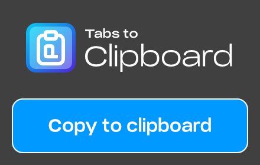
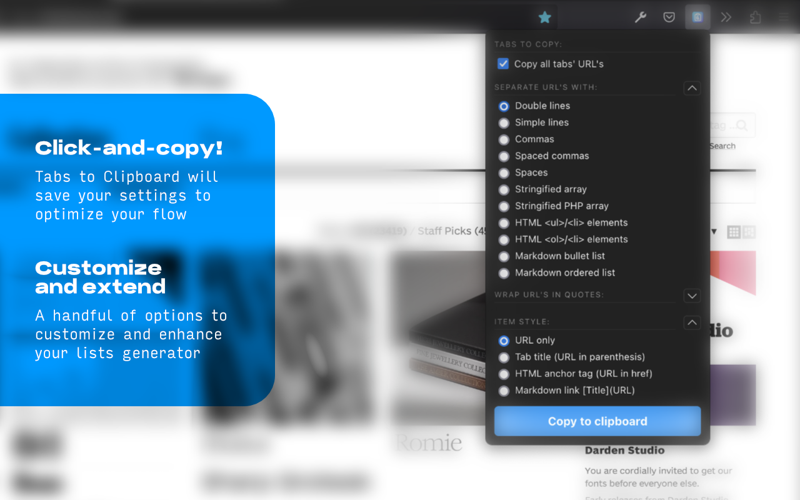

# Tabs to Clipboard

Tabs to Clipboard adds an action icon in Chrome and Firefox that joins every active tab URL into a single string and copy to clipboard. Copy all the URL's of your active tabs with this extension. Tabs to Clipboard allows you to select different styles to your resulting URL list, customize separation, quote wrapping and URL's with current titles.

## Current features

- Copy all your tabs' URL's to clipboard with two clicks
- Select the tabs you want to create a list
- Customize separation of URL listing with simple or double lines, commas, spaced commas, spaces, array formatting (common and PHP), HTML ordered `<ol>` or unordered `<ul>` lists and Markdown bullet or numbered lists
- Add wrapping in quotes (straight quotes, curly marks, guillemets or eastern marks)
- Add page titles to URL lists as CSV rows, HTML anchor `<a>` tags and Markdown links
- Save previously chosen settings and sync settings across devices with [Storage API](https://developer.chrome.com/docs/extensions/reference/storage/)

## Backlog

Future features to be implemented:

- Quick copy a single tab URL
- Interface internationalization
- Open copied URL's in current window

## License

This software is available under the GNU General Public License v2.0.